# 🏗️ AIRA System Architecture & Engineering Report

**Project:** AIRA (Advanced Interactive Robotic Assistant)  
**Event:** Aagaman 3.0 (Prativa ra Prabidhi ko Milan)  
**Version:** 1.0 (Prototype)

---

## ⚡ Executive Summary
AIRA is a **Hybrid Edge-Cloud Embodied AI**. Unlike traditional chatbots that exist only on screens, AIRA integrates **Real-time Sensory Data** (Vision, Audio) with **LLM Intelligence** (Gemini Live) and **Procedural Animation** (Pygame) to create a physically present entity.

The architecture is built on a **Non-Blocking Asynchronous Event Loop**, ensuring that the robot's facial expressions (60 FPS) remain fluid even while processing heavy network requests or audio streams.

---

## 🧩 High-Level System Design

The system follows a **Star Network Topology** where the Central Orchestrator (`main.py`) manages data flow between isolated modules.

```mermaid
graph LR
    %% --- STYLING ---
    classDef cloud fill:#e3f2fd,stroke:#1565c0,stroke-width:2px;
    classDef edge fill:#fff3e0,stroke:#e65100,stroke-width:2px;
    classDef logic fill:#e8f5e9,stroke:#2e7d32,stroke-width:2px;
    classDef human fill:#fce4ec,stroke:#880e4f,stroke-width:2px,stroke-dasharray: 5 5;

    %% --- NODES ---
    User((👤 User / Guest)):::human
    
    subgraph Hardware [Edge Hardware Layer]
        Mic[🎤 Microphone]:::edge
        Cam[📷 Camera]:::edge
        Speaker[🔊 Speaker]:::edge
        Screen[🖥️ 7-inch Display]:::edge
        Motors[⚙️ N20 Motors & Servos]:::edge
    end

    subgraph Software [Python Async Core]
        Vision["👁️ Vision System<br/>(Background Thread)"]:::logic
        AudioMgr["👂 Audio Manager<br/>(Threading)"]:::logic
        FaceEng["🙂 Face Engine<br/>(60 FPS Loop)"]:::logic
        Main{"🧠 Main Orchestrator<br/>(Async Event Loop)"}:::logic
    end

    Cloud(("☁️ Google Gemini<br/>Live API")):::cloud

    %% --- CONNECTIONS ---
    %% Input Flow
    User -->|"Voice & Presence"| Mic & Cam
    Mic -->|"Raw PCM"| AudioMgr
    Cam -->|"Raw Frames"| Vision
    
    %% Internal Processing
    Vision -.->|"Face Coords (x,y)"| FaceEng
    Vision -->|"Compressed JPEG"| Main
    AudioMgr -->|"Input Audio"| Main
    AudioMgr -.->|"RMS Volume"| FaceEng
    
    %% Cloud Handshake
    Main <==>|"WebSocket Stream"| Cloud
    
    %% Output Flow
    Main -->|"State & Emotion"| FaceEng
    Main -->|"Action Tags"| Motors
    Main -->|"Output Audio"| AudioMgr
    
    %% Rendering / Actuation
    AudioMgr -->|"Waveform"| Speaker
    FaceEng -->|"Procedural GFX"| Screen
    
    %% Feedback Loop
    Motors -->|"Physical Action"| User
    Speaker -->|"Voice Response"| User
```

---

## 💻 Software Architecture

### 1. The Core: Asynchronous Orchestration
*   **Technology:** Python `asyncio` + `Threading`
*   **Design Pattern:** Event Loop with Non-Blocking I/O.
*   **Critical Implementation:**
    *   **Legacy Approach:** Recording Audio -> Sending -> Waiting -> Playing. (Result: The robot freezes while talking).
    *   **AIRA Approach:** The `face_drawing_loop` runs independently at 60Hz. Network requests (`send_data_loop`) and Audio playback (`receive_loop`) run as concurrent tasks.
    *   **The Fix:** Audio writing is explicitly offloaded to a separate thread using `asyncio.to_thread`. This bypasses the Python GIL (Global Interpreter Lock) for I/O, allowing the face animation to continue smoothing while audio plays.

### 2. The Visual Cortex: Procedural Face Engine
*   **Technology:** `Pygame`, `Math (Sine/Lerp)`
*   **Innovation:** Vector-based procedural rendering instead of static image loading.
*   **Key Algorithms:**
    *   **Linear Interpolation (Lerp):** Used for smoothing transitions between emotions. Eyes don't "snap" open; they slide open based on `dt` (Delta Time).
    *   **Sine Wave Modulation:** Mouth movement during speech is driven by a sine wave function mixed with random jitter (`sin(time) + noise`), creating an organic "talking" appearance rather than a mechanical on/off state.
    *   **Reactive Eye Tracking:** The eyes use a local Coordinate System mapping. Face coordinates from OpenCV (-1.0 to 1.0) are mapped to pupil pixel offsets, allowing AIRA to maintain eye contact.

### 3. The Auditory System: Full-Duplex Streaming
*   **Technology:** `PyAudio`, `NumPy`
*   **Latency Masking:**
    *   **VAD (Voice Activity Detection):** Uses RMS (Root Mean Square) calculation on raw PCM bytes to detect user speech intensity.
    *   **Thinking Sounds:** To mask the 500ms-1500ms cloud latency, the system injects local "filler sounds" (e.g., "Hmm...", "Hajur?") immediately after VAD silence is detected.

### 4. The Brain: Prompt Engineering
*   **Model:** Google Gemini 2.5 Flash (Native Audio)
*   **Strategy:** "Persona Injection"
    *   The System Prompt is not just instructions; it is a **Personality Core**. It enforces a "Nepali-First" accent protocol by instructing the LLM to use specific Romanized Nepali particles (*Hajur, Ni, Hai*) to override the standard text-to-speech accent.
    *   **Action Tagging:** The LLM does not control hardware directly. It outputs "Tags" (e.g., `[ACTION:GIVE_CHOCOLATE]`). The Orchestrator parses these tags and executes the corresponding Python hardware function.

---

## 🛠️ Development Process: The "10-Day Sprint"

This project was executed using an aggressive **Agile Rapid Prototyping** methodology.

| Phase | Duration | Focus | Key Technical Challenge |
| :--- | :--- | :--- | :--- |
| **1. Conception** | Day 1-2 | Architecture Design | Selecting the right API (Gemini Live vs Standard). |
| **2. The Core** | Day 3-4 | Main Loop & Async IO | Solving the "Blocking Audio" freeze issue using Threading. |
| **3. The Face** | Day 5-6 | Pygame Animation | Tuning the "Lerp" math to make movement feel organic, not robotic. |
| **4. Integration** | Day 7-8 | Hardware & API Link | Implementing the "Action Tag" system for physical movement. |
| **5. Polish** | Day 9-10 | Tuning & Testing | Reducing latency, fixing the "Namaste Loop", and adding "Thinking Sounds". |

### Challenges & Solutions
1.  **Challenge:** The Raspberry Pi 4 struggled to run Computer Vision + Pygame + Network Streaming simultaneously.
    *   **Solution:** We decoupled the Vision System. It runs in a background thread, updating a shared variable `latest_face_pos`. The UI loop just reads this variable without waiting for the camera shutter.

2.  **Challenge:** Text-to-Speech sounded too "American."
    *   **Solution:** Prompt Engineering. We forced the model to use Romanized Nepali fillers (`Huss`, `Hajur`), which tricked the audio engine into adopting a local cadence.

---

## 🔮 Future Roadmap (Post-Aagaman)

The architecture allows for modular upgrades without rewriting the core:

1.  **Local LLM Fallback:** Integrating `Llama-3-8B` (Quantized) for offline conversation when WiFi fails.
2.  **SLAM Navigation:** Using the Camera + Ultrasonic sensors to map the room and move autonomously.
3.  **Object Recognition:** Upgrading the `vision.py` module to recognize specific objects (e.g., "Bring me the water bottle") using YOLOv8.

---
**Developed with ❤️ and ☕ by the Computer Dept (5th Sem), MBCOE.**
