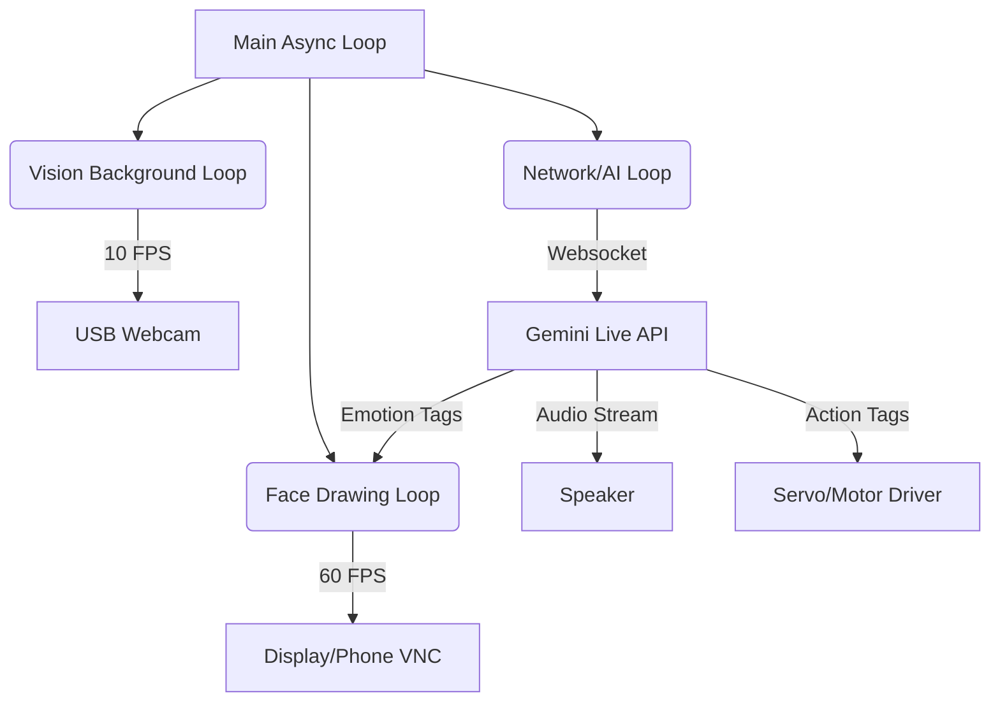

# AIRA-Humanoid-Robot
AIRA (Advanced Interactive Robotic Assistant) is a semi-autonomous humanoid robot designed for intelligent interaction, perception, and safe service in real-world environments.
AIRA is a *semi-autonomous humanoid robotic assistant* designed to interact intelligently with humans using *offline artificial intelligence, **bilingual speech interaction, **vision-based perception, and **safe motion control*.  
The project is developed as a *college-level robotics innovation, with a strong focus on **modularity, safety, privacy, and real-world applicability, especially in the context of **Nepali society*.

**Action:** Create a file named `README.md` in your main folder and paste this raw code in.

***


# 🤖 AIRA (Advanced Interactive Robotic Assistant)
> **"Prativa ra Prabidhi ko Milan"** | *Featured Project at Aagaman 3.0*

   

**AIRA** is an embodied humanoid robot designed to bridge the gap between human interaction and artificial intelligence. Built in a record-breaking **10 days** by students of **Madan Bhandari College of Engineering**, AIRA serves as a host, a companion, and a glimpse into the future of service robotics in Nepal.

---

## 🌟 Key Features

### 🧠 The Brain (Multimodal AI)
*   **Powered by Google Gemini 2.5 Flash:** Processes audio and visual data simultaneously for real-time interaction.
*   **Bilingual & Culturally Aware:** Speaks English and **Nepali** (Romanized accent) with cultural nuances (*Hajur, Ni, Huss*).
*   **Context Aware:** Knows she is at *Aagaman 3.0* and interacts with visitors as a host.

### 👁️ The Face (Procedural Animation)
*   **High-FPS Pygame Engine:** Unlike static images, AIRA's face is drawn mathematically in real-time (60 FPS).
*   **Expressive:** Dynamic emotions including **[HAPPY]**, **[SAD]**, **[ANGRY]**, **[LOVE]**, and **[SURPRISED]**.
*   **Eye Tracking:** Uses OpenCV Haar Cascades to lock eyes with the person talking to her.
*   **Lip Sync:** Mouth moves via Sine Wave modulation triggered by real-time RMS audio volume.

### 🦾 The Body (Hardware Control)
*   **Mobility:** 4x **N20 Gear Motors** for omnidirectional movement.
*   **Gestures:** Servo-controlled arms for interactions (e.g., giving gifts/chocolates).
*   **Action Triggers:** AI-driven physical actions via tag parsing (e.g., `[ACTION:GIVE_CHOCOLATE]`).

---

## 🏗️ System Architecture

AIRA uses a **Non-Blocking Asynchronous Architecture** to ensure she never freezes, even when "thinking."



1.  **Face Loop (High Priority):** Runs on the main thread to ensure buttery smooth animation.
2.  **Vision Loop (Background):** Captures frames and detects faces in a separate thread to prevent lag.
3.  **Network Loop (Async):** Streams audio/video to Google and handles the response.

---

## 🛠️ Hardware Stack

| Component | Specification | Function |
| :--- | :--- | :--- |
| **Compute** | Raspberry Pi 4 (4GB RAM) | The central brain processing vision and logic. |
| **Storage** | 32GB High-Speed Class 10 SD | OS and Asset storage. |
| **Vision** | USB Webcam (Logitech/Generic) | Face tracking and object recognition. |
| **Audio** | USB Microphone + Speaker | Full-duplex voice communication. |
| **Display** | Mobile Phone (via VNC) | High-resolution face display without HDMI cables. |
| **Motors** | 4x N20 Gear Motors | Chassis movement. |
| **Actuators** | MG996R & SG90 Servos | Arm and head movement. |
| **Driver** | PCA9685 / L298N | PWM and Motor control. |

---

## 🚀 Installation & Setup

### Prerequisites
*   Python 3.9+
*   Raspberry Pi OS (Legacy/Bullseye recommended for Camera compatibility)
*   A Google Cloud API Key with Gemini Live access.

### 1. Clone the Repository
```bash
git clone https://github.com/YourUsername/AIRA-Robot.git
cd AIRA-Robot
```

### 2. Install Dependencies
```bash
pip install -r requirements.txt
# Key libs: google-genai, pygame, opencv-python, pyaudio, numpy, python-dotenv
```

### 3. Setup Environment
Create a `.env` file in the root directory:
```env
GOOGLE_API_KEY=your_api_key_here
```

### 4. Run AIRA
```bash
python main.py
```

---

## 👥 The Team (Madan Bhandari College of Engineering)

**Developed by Computer Engineering Students (5th Semester)**

*   👑 **Bishnu Gautam** (Team Leader / Captain)
*   💻 **Sayuja Bhattarai**
*   💻 **Saras Shrestha**
*   💻 **Lalit Budathoki**
*   💻 **Amisha Kumari**
*   💻 **Ganga Poudel**
*   💻 **Bipasha Neupane**

**Mentorship:**
*   🎓 **Er. Dinesh Mahato**

---

## 🔮 Future Roadmap

AIRA is currently a **Prototype (V1.0)**. The roadmap for V2.0 includes:
*   [ ] **Llama 3 Local LLM:** For offline conversation capabilities.
*   [ ] **Navigation:** LIDAR integration for autonomous mapping.
*   [ ] **Healthcare Module:** Vital sign monitoring and medicine delivery.
*   [ ] **Waiter Mode:** Table mapping and tray balancing logic.

---

## 📸 Exhibition Gallery


---
*Made with ❤️ in Nepal | Aagaman 3.0*
```
