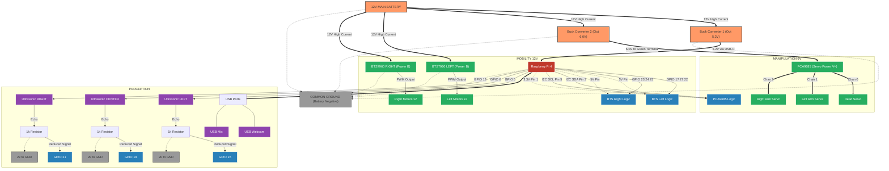

### ⚡ electrical & Logic Diagram

```mermaid
graph TD
    %% --- STYLES ---
    classDef power fill:#f96,stroke:#333,stroke-width:2px;
    classDef ground fill:#999,stroke:#333,stroke-width:1px;
    classDef pi fill:#c0392b,stroke:#fff,stroke-width:2px,color:#fff;
    classDef logic fill:#2980b9,stroke:#fff,stroke-width:1px,color:#fff;
    classDef motor fill:#27ae60,stroke:#fff,stroke-width:1px,color:#fff;
    classDef sensor fill:#8e44ad,stroke:#fff,stroke-width:1px,color:#fff;

    %% --- POWER SOURCE ---
    BAT["12V MAIN BATTERY"]:::power
    
    %% --- VOLTAGE REGULATION ---
    BUCK1["Buck Converter 1 (Out 5.2V)"]:::power
    BUCK2["Buck Converter 2 (Out 6.0V)"]:::power
    
    %% --- COMPUTING ---
    PI("Raspberry Pi 4"):::pi
    
    %% --- POWER DISTRIBUTION FLOW ---
    BAT ==>|12V High Current| BUCK1
    BAT ==>|12V High Current| BUCK2
    BAT ==>|12V High Current| BTS_L_PWR["BTS7960 LEFT (Power B)"]:::motor
    BAT ==>|12V High Current| BTS_R_PWR["BTS7960 RIGHT (Power B)"]:::motor
    
    BUCK1 ==>|5.2V via USB-C| PI
    BUCK2 ==>|6.0V to Green Terminal| PCA_PWR["PCA9685 (Servo Power V+)"]:::motor

    %% --- MOTORS LEGS ---
    subgraph "MOBILITY 12V"
        BTS_L_PWR -->|PWM Output| M_LF["Left Motors x2"]:::motor
        BTS_R_PWR -->|PWM Output| M_RF["Right Motors x2"]:::motor
        
        PI -->|GPIO 17 27 22| BTS_L_LOGIC["BTS Left Logic"]:::logic
        PI -->|GPIO 23 24 25| BTS_R_LOGIC["BTS Right Logic"]:::logic
        
        %% Shared Logic Power
        PI -.->|5V Pin| BTS_L_LOGIC
        PI -.->|5V Pin| BTS_R_LOGIC
    end

    %% --- SERVOS ARMS HEAD ---
    subgraph "MANIPULATION 6V"
        PI -->|I2C SDA Pin 3| PCA_DATA["PCA9685 Logic"]:::logic
        PI -->|I2C SCL Pin 5| PCA_DATA
        PI -.->|3.3V Pin 1| PCA_DATA
        
        PCA_PWR ==>|Chan 0| S_HEAD["Head Servo"]:::motor
        PCA_PWR ==>|Chan 1| S_L_ARM["Left Arm Servo"]:::motor
        PCA_PWR ==>|Chan 2| S_R_ARM["Right Arm Servo"]:::motor
    end

    %% --- SENSORS PERCEPTION ---
    subgraph "PERCEPTION"
        CAM["USB Webcam"]:::sensor
        MIC["USB Mic"]:::sensor
        
        PI === USB_BUS["USB Ports"]
        USB_BUS --- CAM
        USB_BUS --- MIC
        
        %% ULTRASONICS
        US_L["Ultrasonic LEFT"]:::sensor
        US_C["Ultrasonic CENTER"]:::sensor
        US_R["Ultrasonic RIGHT"]:::sensor
        
        %% Logic Connections
        PI -->|GPIO 5| US_L
        PI -->|GPIO 6| US_C
        PI -->|GPIO 13| US_R
        
        %% Voltage Dividers
        US_L -->|Echo| R1["1k Resistor"]
        US_C -->|Echo| R2["1k Resistor"]
        US_R -->|Echo| R3["1k Resistor"]
        
        R1 -->|Reduced Signal| PI_GPIO26["GPIO 26"]:::logic
        R2 -->|Reduced Signal| PI_GPIO19["GPIO 19"]:::logic
        R3 -->|Reduced Signal| PI_GPIO21["GPIO 21"]:::logic
        
        %% Grounding Resistors
        R1 -.-> GND_L["2k to GND"]:::ground
        R2 -.-> GND_C["2k to GND"]:::ground
        R3 -.-> GND_R["2k to GND"]:::ground
    end

    %% --- COMMON GROUND ---
    GND_BUS["COMMON GROUND (Battery Negative)"]:::ground
    BAT -.-> GND_BUS
    BUCK1 -.-> GND_BUS
    BUCK2 -.-> GND_BUS
    PI -.-> GND_BUS
    BTS_L_PWR -.-> GND_BUS
    BTS_R_PWR -.-> GND_BUS
```
